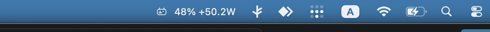
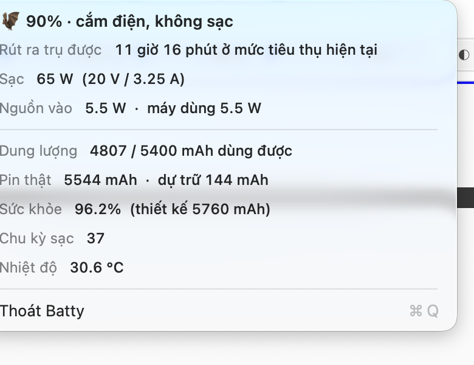

# Batty 🦇

A tiny macOS menu bar app that shows what your battery is actually doing: charge
level, live charging power in watts, charge rate, adapter details, health, cycles
and temperature.





## Why

macOS tells you a percentage and an estimate. Batty reads the raw
`AppleSmartBattery` IORegistry node, so you get the numbers behind it — how many
watts are flowing right now, how fast the pack is filling, and how much of its
original capacity is left.

## Install

```bash
git clone https://github.com/hataketsu/batty.git
cd batty
./build.sh
```

`build.sh` leaves `Batty.app` in the repo root — drag it into `/Applications`, or:

```bash
cp -R Batty.app /Applications/
open /Applications/Batty.app
```

Requires macOS 13+ and the Swift toolchain that ships with Xcode or the Command
Line Tools. No permissions, no network access, no dependencies.

To launch it at login: System Settings → General → Login Items → add Batty.

## What it shows

| Row | Meaning |
| --- | --- |
| Còn lại | Time to full while charging, time to empty on battery |
| Công suất | Live power in watts, with the raw current and pack voltage |
| Tốc độ | Charge rate as a share of full capacity per hour |
| Sạc | Rated adapter wattage and the negotiated USB-PD voltage/current |
| Nguồn vào | Power drawn from the wall vs. power the machine is consuming |
| Dung lượng | Current vs. full charge capacity in mAh |
| Chai pin | Full charge capacity against the pack's design capacity |
| Chu kỳ sạc | Cycle count |
| Nhiệt độ | Battery temperature |

## How it works

`BatteryReader` opens the `AppleSmartBattery` IOService once per tick and copies
its properties — no `ioreg` subprocess, no polling of `pmset`. The menu bar
refreshes every 5 seconds, and every second while the menu is open, which keeps
it at roughly 0% CPU.

`Amperage` is published as an unsigned 64-bit value, so discharging shows up as a
very large number; Batty reinterprets it as a signed integer. `AvgTimeToFull` and
`AvgTimeToEmpty` use 65535 as "still estimating" and are hidden until the gauge
settles.

## Layout

```
Sources/Batty/
  main.swift           NSApplication bootstrap, accessory (menu bar only) mode
  AppDelegate.swift    status item, refresh timers
  BatteryReader.swift  IOKit read into a BatterySnapshot
  MenuFormatter.swift  status title and dropdown rows
  BattyIcon.swift      the bat-battery glyph, drawn with NSBezierPath
tools/make-icon.swift  renders the .iconset for the app bundle
build.sh               builds the binary, icon and Batty.app
```

## License

MIT
